## How to control 🕹️

| Key | Function |
|---|---|
| Spacebar | Next Slide |
| Arrow Keys | Navigate Slides |
| O | Deck Overview |
| S | Speaker Notes |

Note: Built with [reveal-md](https://github.com/webpro/reveal-md#speaker-note) and [reveal.js](https://revealjs.com/) by Ryan Sheehan

---

## The Plan 👍

> _I want to be a better at ~listening~~coaching~4-conversations._ 
> 
> -Me

Note: The initial goal was wrong.  There's almost always a need to scratch deeper.

---

## The 4 Conversations

| Conversation | Objective |
|---|---|
| Initiative | Staking the goal post 🥅 |
| Understanding | Get the buy-in 💵 |
| Performance | Ask for a promise of delivery with deadline 📦 |
| Closure | Review the facts 💯 |

Note: These are my own personal definitions, but I think they closely align.  The closure conversation I would include identifying what went right and wrong.

---

## My advice to me

Note: Yo Dawg 🐕, I put a conversation with myself about myself for myself in a presentation about myself.

---

## Development Pipeline

<!-- .slide: class="white" data-background="white" -->

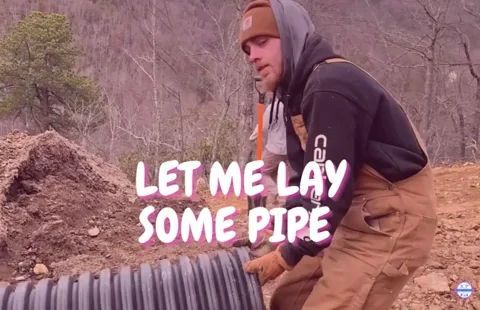

Deep dive ⬇️!

Note: Just a transition.  Nothing to 👀 here!

----

<!-- .slide: class="white" data-background="white" data-transition="slide-in fade-out" -->

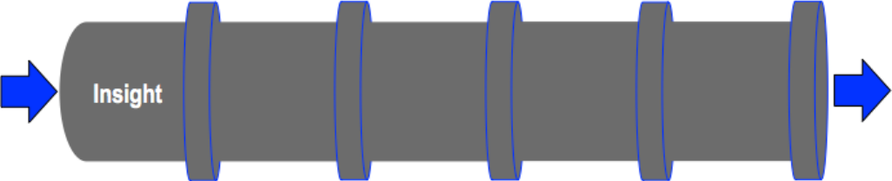

> _"I need to organize my approach to coaching my employees, and all my conversations."_ -Me

Note: The real insight is that 4-conversations is really effective to organizing people to achieve a goal.

----

<!-- .slide: class="white" data-background="white" -->

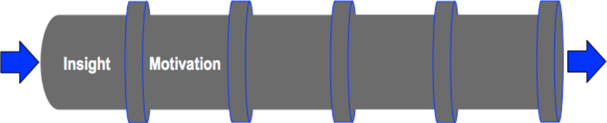

> _"Effective communication can drive the success of my employees, my team, and my organization."_ -Me

Note: Once you see the effectiveness of the 4-conversations, it's hard to unsee the categorization of the conversations.  It's incredibly motivating to see the light bulbs trigger in others when they realize a conversation is missing.

----

<!-- .slide: class="white" data-background="white" -->

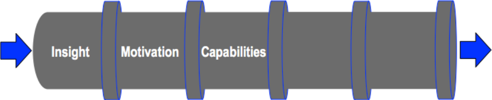

> _"I'm very comfortable expressing my ideas, and I can anticipate the types of conversations I need to prepare."_ -Me

Note: Capabilities for this is simply being comfortable to speak up.

----

<!-- .slide: class="white" data-background="white" -->

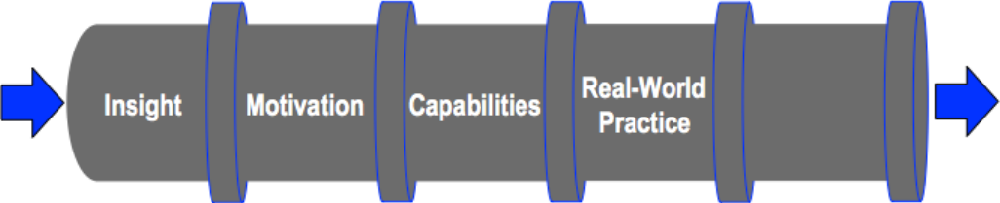

> _"Every meeting is an opportunity to categorize the messages I want to craft."_ -Me

Note: Its not uncommon to cover all 4 conversations within a single meeting.  I often find myself explicitly stating the category of the conversation I am having.  People intuitively get initiative, understanding, ask and promise, and closure conversations, even when they know nothing else.

----

<!-- .slide: class="white" data-background="white" data-transition="slide-out" -->

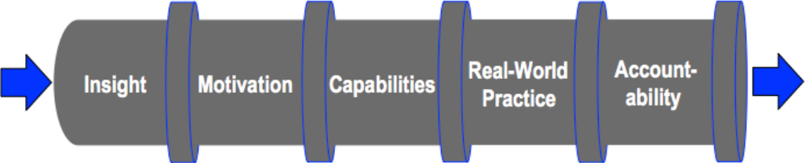

> _"Oh boy, how do I do hold myself accountable??"_ -Me

Note: I found this an interesting challenge, but not-really-a-challenge.  When I explicitly categorize the conversation I am holding, people understand my focus.  My hope is seeing the ideas of the 4-conversations spread, because I have already found it so effective at work.  Seeing the basic outline spread would be evidence of success.

---

<!-- .slide: class="glass-quote" data-background="assets/plants-growing.jpg" data-transition="slide" -->

> _"Every day do something that will inch you closer to a better tomorrow."_ 
>
> -Doug Firebaugh

Note: I liked this quote.  Gotta keep moving forward! 🚀

----

## Accountability Coaching Strategies

<!-- .slide: class="white" data-background="assets/lego.jpg" data-transition="slide" -->

Note: Snapping in the lego! 🧱 This one is weird since it's about the coach.  Am I coaching myself, or coaching my boss and peers in coaching me!!  It's very meta.  My approach is to coach my boss and peers to coach me to gain more accountability.

----

<!-- .slide: class="white" data-background="white" data-transition="slide-in fade-out" -->

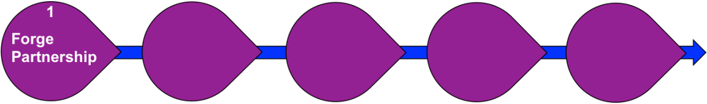

> _"Hey guys, I am committing to using the 4-conversations."_ -Me to my boss and peers

Note: I have already done this. I've pointed my boss and some peers to the book, but laid out this is an approach I am taking moving forward.

----

<!-- .slide: class="white" data-background="white" -->

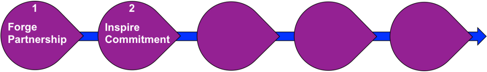

> _"The 4-conversations just make sense. Let's make sure we are having the right conversation with external teams."_ -Me to my peers.

Note: What has been great so far is that when I explained the 4 conversations, it really identified a roadmap for engaging teams outside our division.  It's identified gaps in our approach for implementing some large changes.  A lot of people are on board now.

----

<!-- .slide: class="white" data-background="white" -->

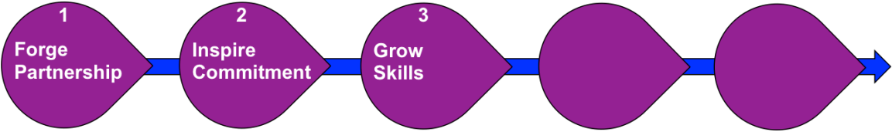

> _"What are the 4 conversations?  Let's ask and get a promise from the other team!"_ -Boss/Peers to me

Note: My goal here is to promote explicit focus on the target conversation.  It doesn't work in all contexts, but it's amazing lay out the phases of the conversations we are having.

----

<!-- .slide: class="white" data-background="white" -->

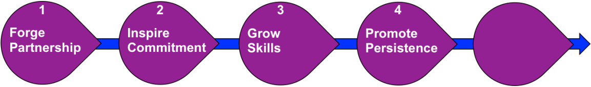

> _"Can you guys question me from time to time on my conversation approach?"_ -Me asking my peers

Note: The goal here is to really ask others to keep me on my toes. The persistence is key to making the ideas stick.

----

<!-- .slide: class="white" data-background="white" data-transition="slide-out" -->

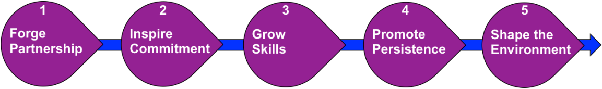

> _"This conversation is unproductive.  How can we ask the other team for a commitment if they don't understand the initiative."_ -Me to my team.

Note: This is a real quote.  We are trying to roll out some big company wide changes.  The default from engineering is to ask executive management to make the changes a decree.  I know it wont work if we take that approach.  They must understand the initiative, their place in the objective, then we can make the ask for a promise of delivery.  Shaping the environment here is removing the unproductive dialog.

---

## Where I practice

<ul>
    <li>👨‍🔧👩‍🎨 1 on 1 conversations</li>
    <li class="fragment fade-left">👩‍🏫🤷‍♂️ strategy meetings</li>
    <li class="fragment fade-left">👩‍💼🤦‍♂️ yearly reviews</li>
</ul>

Note: Really there are a ton more places to do approach these conversations.  I need to try it with the kids 👪.  The conversation order is always a mix, but "Gotta keep moving forward! 🚀"

---

## Staying Accountable

| Who | How |
|---|---|
| Manager | Hold me accountable, and reflect on it in 1 on 1 meetings |
| Peers | Discuss conversation intent during meetings |
| Notes | Prepare conversation category notes prior to meetings |

Note: I've already asked my boss to hold me accountable, and I have asked a couple peers to frame our cooperations with the 4 conversations in mind.  Taking notes about conversation topics is something I already do.  Marking them up will allow me to reflect after a meeting if the conversation took the expected direction based on how I marked them.

---

## Final Reflection

<!-- .slide: class="glass-quote" -->

> _"Leader-as-a-coach brought organization to my conversations. It will not only help me focus on improving the success of my conversations, it also helps me bring out the best in those I work with."_
>
> -Ryan Sheehan

Note: This class was excellent.  I've found it has been immediately applicable in my work life, and I am already reframing my conversations and my approach in building others.
